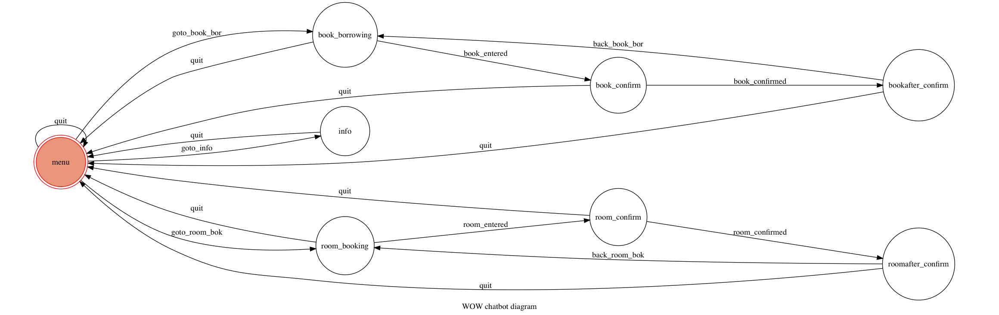

# WOW_chatbot

<h3>FSM</h3>

<h3>設定</h3>

我是使用MAC OS X去完成這次作業，一開始要確定系統有安裝<code>python-telegram-bot</code>, <code>Graphviz</code>, <code>pygraphviz</code>, <code>ngrok</code>才可執行程式

一開始先到Terminal輸入<code>ngrok http 8000</code>, 然後複制它所派給的URL, 再放到app.py中的 <code>status = bot.set_webhook()</code>內

<h3>執行</h3>

設定後在terminal輸入<code>python3 app.py</code>執行

在Telegram chatbot對話輸入 "hello" 它便會顯示出使用的指引

在menu state內輸入1會顯示新書推介

輸入2會進入書本預約的state

輸入3會進入自修室預約的state

輸入4會進入查看已預約的書或自修室的state

<strong>在任何情況下輸入exit()都會馬上回到menu state</strong>
